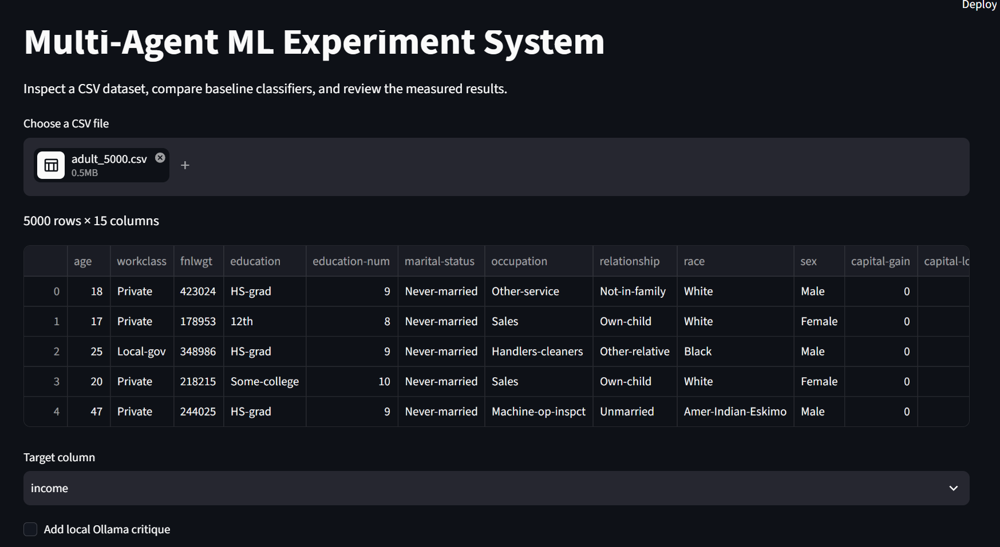
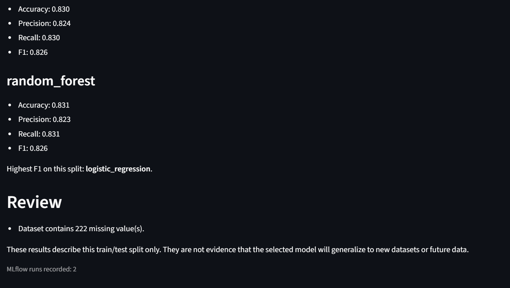
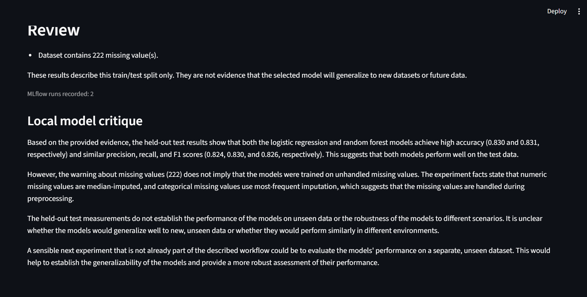

# Multi-Agent ML Experiment System

I built this project to explore how a structured set of components can organize a machine-learning experiment while keeping the modeling and evaluation steps visible.

A CSV dataset moves through a LangGraph workflow that profiles the data, trains baseline classifiers, reviews the measured results, records runs with MLflow, and writes an experiment report. A local Ollama model can optionally critique the experiment using only the metrics, warnings, and preprocessing details supplied to it.

## Workflow

```text
CSV dataset
    |
Data analysis
    |
Model training
    |
Evaluation review
    |
MLflow tracking
    |
Experiment report
    |
Optional local Ollama critique
```

The current modeling path is for classification. Logistic Regression and Random Forest use the same train/test split so their metrics are directly comparable. Numeric features are median-imputed and scaled. Categorical features are most-frequent-imputed and one-hot encoded.

The report includes accuracy, weighted precision, weighted recall, and weighted F1. The review also flags configured concerns such as missing values, duplicate rows, strong target imbalance, and very small test splits.

## Why I added the local critique

I wanted to see whether a local language model could add a useful review without replacing the measured evaluation. The Ollama critique receives the experiment facts and held-out test metrics after the deterministic workflow has finished. Its instructions explicitly prevent it from inventing metrics or treating unmeasured conclusions as facts.

This part is optional. The ML experiment and report run without Ollama.

## Experiment tracking

MLflow records a run for each evaluated model. The project uses a local SQLite tracking database by default:

```text
sqlite:///mlflow.db
```

Local MLflow data, uploaded datasets, virtual environments, caches, logs, and environment files are excluded from Git.

## Running the project

Python 3.11 or newer is required.

```bash
python -m venv .venv
pip install -e ".[dev]"
streamlit run app.py
```

Upload a CSV file, choose the classification target, and run the experiment. To use the optional critique, run Ollama locally with the configured model and enable **Add local Ollama critique** in the interface.

The default local model settings are shown in `.env.example`. They can be overridden with a local `.env` file.

## Checks

```bash
pytest -q
ruff check .
```

The tests cover dataset profiling, model comparison, experiment review, report generation, and MLflow tracking. I also tested the complete Streamlit workflow with a 5,000-row sample of the public Adult/Census Income dataset, including MLflow recording and the optional local critique. The dataset itself is not committed.

## Screenshots

The screenshots under `docs/screenshots/` record the interface and the experiments I used while checking the workflow. Some earlier screenshots are intentionally kept because they show how the local critique changed during testing.

Final dataset input:



Measured experiment results:



Final local critique:



## Current boundaries

This is deliberately a focused experiment system rather than an automated model-selection service.

- It currently handles classification, not regression.
- It compares Logistic Regression and Random Forest rather than searching a large model space.
- It uses one train/test split; it does not currently run cross-validation or hyperparameter search.
- The review flags a small set of known concerns but does not claim to detect every form of leakage or modeling error.
- MLflow records experiment metrics and basic run information; trained model artifacts are not currently logged.
- The Ollama critique is advisory text generated after the LangGraph workflow. It is not used to alter model selection or measured results.

These limits are useful for keeping the experiment easy to inspect and for making future changes measurable.
